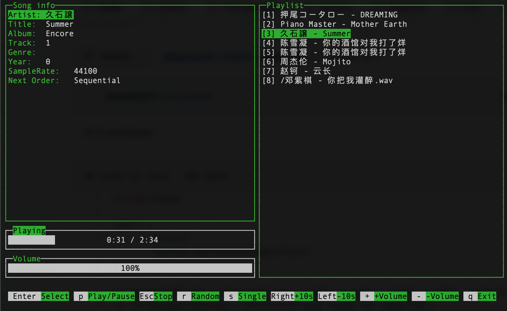

#

## play music with cmd UI



```sh
➜  playmusic go run main.go -h   
playmusic tool in golang to play music from cmd
Version: 0.0.1
Usage: playmusic [-hvi] [-h help] [-v version] [-i input music folder/file path]
Options
  -h    help info
  -i string
        input music folder/file path
  -v    version info
```

thanks to:
- [goPlayer](https://github.com/And678/goPlayer)
- [termui](https://github.com/gizak/termui/)
- [beep](https://github.com/faiface/beep)
- [tag](https://github.com/dhowden/tag/)
